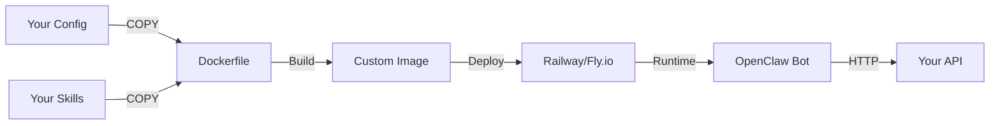

# Custom OpenClaw Template

A **wrapper deployment template** for the [`openclaw/openclaw`](https://github.com/openclaw/openclaw) bot that allows you to inject custom **Skills**, **Identity**, and **Configuration** without forking the core codebase.

## What This Is

This repository provides a clean way to:
- Use the official OpenClaw Docker image as-is
- Override the bot's personality via `customizations/config/system_prompt.md`
- Add custom skills (like API bridges) without touching source code
- Deploy to Railway, Fly.io, or any container platform

## Architecture



## Repository Structure

```
custom-openclaw-template/
├── Dockerfile              # Extends official image
├── docker-compose.yml      # Local development
├── .env.example            # Environment variables template
│
└── customizations/         # Single mount point for Railway
    ├── config/
    │   ├── system_prompt.md    # Bot identity/personality
    │   └── settings.json       # Non-secret configuration
    │
    └── skills/
        └── api-bridge/         # Generic HTTP bridge skill
            ├── manifest.json   # Tool definition for LLM
            ├── handler.py      # Request handler script
            └── README.md       # Skill documentation
```

## Quick Start

### 1. Clone This Repository

```bash
git clone https://github.com/yourusername/custom-openclaw-template.git
cd custom-openclaw-template
```

### 2. Configure Platform Integrations

OpenClaw supports multiple chat platforms. **Choose the ones you want** - they're all optional:

```bash
cp .env.example .env
```

Edit `.env` and **uncomment only the platforms you need**:

**Discord**
| Variable | How to Get It |
|----------|---------------|
| `DISCORD_BOT_TOKEN` | [Discord Developer Portal](https://discord.com/developers/applications) → New Application → Bot → Reset Token |

**Telegram**
| Variable | How to Get It |
|----------|---------------|
| `TELEGRAM_BOT_TOKEN` | Message `@BotFather` on Telegram → `/newbot` → Follow prompts |

**WhatsApp**
| Setup | Instructions |
|-------|--------------|
| QR Login | Run `openclaw channels login` after deployment (no token needed) |

**Slack**
| Variable | How to Get It |
|----------|---------------|
| `SLACK_BOT_TOKEN` | [Slack API](https://api.slack.com/apps) → Create App → OAuth & Permissions |
| `SLACK_APP_TOKEN` | Same app → Basic Information → App-Level Tokens |

**Mattermost**
| Variable | How to Get It |
|----------|---------------|
| `MATTERMOST_TOKEN` | Deploy as plugin - see [docs](https://docs.openclaw.ai/channels/mattermost) |

### 3. Configure Your Backend API

Set the middleware configuration:

```bash
# Required: Your backend API URL
MIDDLEWARE_URL=https://your-api.example.com
API_KEY=your-secret-api-key

# Required: LLM provider
OPENAI_API_KEY=sk-your-openai-key
```

### 4. Customize the Bot Identity

Edit [`customizations/config/system_prompt.md`](customizations/config/system_prompt.md) to define your bot's personality:

```markdown
You are **MyBot**, a helpful assistant...
```

### 5. Run Locally

```bash
docker compose up --build
```

The bot will start with your custom configuration and skills loaded.

## Multi-Platform Deployment

You can enable multiple platforms simultaneously. The bot will respond on all configured platforms.

**Example: Discord + Telegram**
```bash
DISCORD_BOT_TOKEN=your-discord-token
TELEGRAM_BOT_TOKEN=your-telegram-token
```

**Example: All platforms**
```bash
DISCORD_BOT_TOKEN=...
TELEGRAM_BOT_TOKEN=...
SLACK_BOT_TOKEN=...
SLACK_APP_TOKEN=...
```

> [!TIP]
> Start with one platform to test, then add more as needed. Each platform operates independently.

## Customization Guide

### Step 1: Configure the API Bridge for Your Backend

The included `api-bridge` skill connects your bot to any REST API. To configure it:

1. **Set your API endpoint** in `.env`:
   ```bash
   MIDDLEWARE_URL=https://your-api.example.com
   API_KEY=your-secret-token
   ```

2. **Update the manifest description** in `customizations/skills/api-bridge/manifest.json` to tell the LLM what your API does:
   ```json
   {
     "name": "api_bridge",
     "description": "Fetches data from the backend API. Use this to get user information, resources, and perform operations.",
     ...
   }
   ```

3. **Test it works**:
   ```bash
   echo '{"method":"GET","endpoint":"/health"}' | \
     MIDDLEWARE_URL=https://your-api.com API_KEY=test \
     python3 customizations/skills/api-bridge/handler.py
   ```

### Step 2: Customize the Bot Identity

Edit `customizations/config/system_prompt.md` to define who your bot is:

**Example: Support Assistant**
```markdown
You are **SupportBot**, a helpful customer support assistant.

## Your Role
- Answer customer questions clearly and professionally
- Fetch real-time data from the backend API using the `api_bridge` tool
- Escalate complex issues to human agents when needed

## Available API Endpoints
When using `api_bridge`, these endpoints are available:
- `GET /users/{id}` - Get user details
- `GET /tickets` - List support tickets
- `POST /tickets` - Create new ticket

## Communication Style
Be friendly, professional, and solution-oriented.
```

### Step 3: Add Custom Skills (Optional)

To add a new skill beyond the API bridge:

1. Create the skill directory:
   ```bash
   mkdir -p customizations/skills/weather-lookup
   ```

2. Create `manifest.json` with the tool schema:
   ```json
   {
     "name": "weather_lookup",
     "description": "Gets current weather for a location",
     "parameters": {
       "type": "object",
       "properties": {
         "city": { "type": "string", "description": "City name" },
         "country": { "type": "string", "description": "Country code (BR, US, etc)" }
       },
       "required": ["city"]
     },
     "handler": "./handler.py"
   }
   ```

3. Create `handler.py`:
   ```python
   #!/usr/bin/env python3
   import sys, json, os, requests

   args = json.loads(sys.stdin.read())
   city = args.get("city")
   api_key = os.environ.get("WEATHER_API_KEY")
   
   response = requests.get(f"https://api.weather.com/{city}?key={api_key}")
   print(json.dumps(response.json()))
   ```

4. Make it executable:
   ```bash
   chmod +x customizations/skills/weather-lookup/handler.py
   ```

5. Add any new env vars to `.env.example`:
   ```bash
   WEATHER_API_KEY=your-weather-api-key
   ```

### Step 4: Modify the API Bridge Handler

For advanced customization of the HTTP bridge:

| Customization | Where to Edit |
|---------------|---------------|
| Change auth method (API key header, Basic auth) | `handler.py` lines 40-45 |
| Add retry logic | Add `requests.adapters.HTTPAdapter` with retry config |
| Transform responses | Modify the `result` dict before `print()` |
| Add request logging | Add `print()` to stderr for debugging |

**Example: Use custom header instead of Bearer token**
```python
# In handler.py, replace:
headers["Authorization"] = f"Bearer {api_key}"

# With:
headers["X-API-Key"] = api_key
```

## Configuration Reference

### Environment Variables

**Core Configuration**
| Variable | Required | Description |
|----------|----------|-------------|
| `MIDDLEWARE_URL` | yes | Base URL of your backend API (no trailing slash) |
| `API_KEY` | yes | Authentication token for API requests |
| `OPENAI_API_KEY` | yes* | OpenAI API key (*or other LLM provider) |

**Platform Integrations** (at least one required)
| Variable | Platform | Description |
|----------|----------|-------------|
| `DISCORD_BOT_TOKEN` | Discord | Bot token from Discord Developer Portal |
| `TELEGRAM_BOT_TOKEN` | Telegram | Bot token from @BotFather |
| `SLACK_BOT_TOKEN` | Slack | Bot User OAuth Token |
| `SLACK_APP_TOKEN` | Slack | App-Level Token (for Socket Mode) |
| `MATTERMOST_URL` | Mattermost | Mattermost server URL |
| `MATTERMOST_TOKEN` | Mattermost | Personal access token |

**Alternative LLM Providers**
| Variable | Provider | Description |
|----------|----------|-------------|
| `ANTHROPIC_API_KEY` | Claude | Anthropic API key (alternative to OpenAI) |

**Optional**
| Variable | Default | Description |
|----------|---------|-------------|
| `LOG_LEVEL` | info | Logging verbosity (debug, info, warn, error) |
| `REQUEST_TIMEOUT` | 30 | HTTP request timeout in seconds |

> [!NOTE]
> WhatsApp uses QR code login via the OpenClaw CLI (`openclaw channels login`) and doesn't require environment variables.

### Settings File

[`customizations/config/settings.json`](customizations/config/settings.json) contains non-secret configuration:

```json
{
  "request_timeout": 30,
  "max_retries": 3,
  "log_level": "info"
}
```

> [!CAUTION]
> Never put secrets in `settings.json`—use environment variables instead!

## Testing

### Test the API Bridge Locally

```bash
# Start the bot
docker compose up

# In Discord, try:
# "Can you fetch data from /users/123?"
```

### Test Handler Directly

```bash
echo '{"method":"GET","endpoint":"/test"}' | \
  MIDDLEWARE_URL=https://api.example.com \
  API_KEY=test-key \
  python3 customizations/skills/api-bridge/handler.py
```

## Deployment

### Railway

1. **Push to GitHub**
   ```bash
   git init
   git add .
   git commit -m "Initial commit"
   git remote add origin https://github.com/yourusername/your-bot.git
   git push -u origin main
   ```

2. **Create Railway Project**
   - Go to [Railway](https://railway.app)
   - Click "New Project" → "Deploy from GitHub repo"
   - Select your repository

3. **Configure Environment Variables**
   - In Railway dashboard, go to "Variables" tab
   - Add all required variables from `.env.example`
   - **Required minimum variables:**
     - `MIDDLEWARE_URL` - Your backend API URL
     - `API_KEY` - Your backend API authentication key
     - `OPENAI_API_KEY` - Your OpenAI API key
     - `OPENCLAW_GATEWAY_TOKEN` - Generate with: `openssl rand -hex 32`
     - At least one platform token (e.g., `DISCORD_BOT_TOKEN`)

4. **Set Start Command**
   > [!IMPORTANT]
   > Railway requires you to set a custom start command
   
   - Go to "Settings" tab
   - Scroll to "Deploy" section
   - Set **Custom Start Command** to:
     ```
     node dist/index.js
     ```
   - Click "Deploy"

5. **Monitor Logs**
   - Check the "Deployments" tab to see build and runtime logs
   - The bot should start and connect to your configured platforms

### Other Platforms

For Fly.io, Render, or other platforms, ensure you:
- Set all environment variables
- Configure the start command as `node dist/index.js`
- Expose any necessary ports (OpenClaw typically uses 18789 for the gateway)

## Troubleshooting

### Handler Not Executing

**Problem**: Skill handler doesn't run when invoked.

**Solution**: Ensure the handler is executable:
```bash
chmod +x customizations/skills/*/handler.py
```

### API Requests Failing

**Problem**: Getting connection errors or 401 Unauthorized.

**Solution**: 
1. Verify `MIDDLEWARE_URL` is correct (no trailing slash)
2. Check `API_KEY` is set and valid
3. Test the endpoint manually:
   ```bash
   curl -H "Authorization: Bearer $API_KEY" $MIDDLEWARE_URL/test
   ```

### Bot Not Loading Custom Prompt

**Problem**: Bot doesn't reflect changes in `system_prompt.md`.

**Solution**: Rebuild the Docker image:
```bash
docker compose down
docker compose up --build
```

## Resources

- [OpenClaw Documentation](https://github.com/openclaw/openclaw)
- [Discord Developer Portal](https://discord.com/developers/applications)
- [Railway Documentation](https://docs.railway.app)
- [Fly.io Documentation](https://fly.io/docs)

## Contributing

This is a template repository. Feel free to fork and customize for your needs!

---

**Built with 🦞 for the OpenClaw community**
